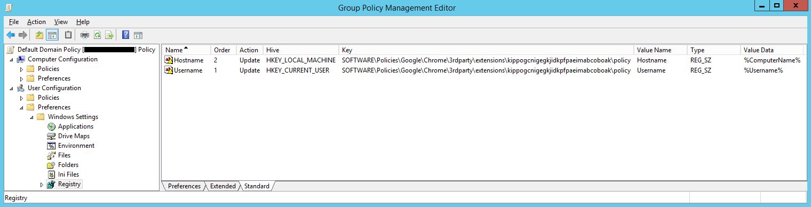
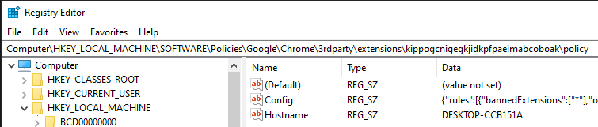
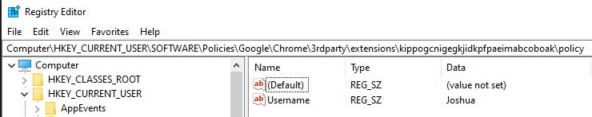

# Download Blocker

Chrome web store link: https://chrome.google.com/webstore/detail/download-blocker/kippogcnigegkjidkpfpaeimabcoboak

## What is it?

Download Blocker is a Google Chrome extension which blocks certain files from being downloaded, based on a number of different data / metadata properties. It was created as a way to prevent HTML smuggling attacks, but it can also block downloads from webservers too.

HTML smuggling is essentially a technique for bypassing web-proxies / firewalls that perform content inspection on files downloaded from a server. It does this by using HTML5 APIs to provide a client-side download using javascript, without making a request to a webserver. For an in-depth description of HTML smuggling, please see the references below.

## Change Log

## 1.1.1
* Fix for https://github.com/SecurityJosh/DownloadBlocker/issues/7 kindly provided by https://github.com/z3r0privacy.

## 1.1.0
* fileInspectionData now contains a new key, 'zipContainsEncryptedFiles', which is a boolean value indicating if a .zip file contains any files which are encrypted.

## 1.0.9
* Added 'matchFileNamesInZip' rule property which applies the bannedExtensions and fileNameRegex configuration to file names found within a zip file.
* Added the {actionResult} placeholder.
* Fixed issue which meant that downloads set to 'Open' in Edge would never be blocked before the user could open the file.
* Hotfix for a bug in older versions (< 1.3.0) of the Native Messaging Host.

## 1.0.8
* Fixed an oversight which meant that HTML Smuggled downloads from a HTTP origin were not inspected by the content script. (Native Messaging host unaffected)
* Thanks to a fix in Chromium, HTML Smuggled downloads via a data: URI can now be inspected by the content script.

## 1.0.7
* Better error handling when a download's referrer is unavailable
* Make sure that non-smuggled downloads get an early cancellation opportunity as per 1.0.5.

## 1.0.6
* Fix for https://github.com/SecurityJosh/DownloadBlocker/issues/7
* The urlScheme filter would always look at the referring page, which makes sense for HTML Smuggled downloads but not for downloads from a web server. In this case the extension now takes the finalUrl value from the DownloadItem.

## 1.0.5
* Reverted blocking behavior to be consistent with versions 0.2.0 and prior. This means that downloads are, by default, now blocked as early as possible instead of waiting for the download to complete in order to give the Native Messaging Host change to obtain the file metadata. This change has been made because a user might have the chance to click a long-running download, meaning the item would automatically open when complete. This meant that the extension might not cancel and remove the download quickly enough to prevent it being opened. Rules now support the 'responsePriority' property which allows this behavior to be configured on a per-rule basis.

Full change log available [here](CHANGELOG.md)

## Configuration

This extension was created with enterprises in mind, so configuration isn't available to the end user. Instead, settings are applied via the 'Config' registry value under the following key:

`HKEY_LOCAL_MACHINE\SOFTWARE\Policies\Google\Chrome\3rdparty\extensions\kippogcnigegkjidkpfpaeimabcoboak\policy` (For Google Chrome)
`HKEY_LOCAL_MACHINE\SOFTWARE\Policies\Microsoft\Edge\3rdparty\extensions\kippogcnigegkjidkpfpaeimabcoboak\policy` (For Chromium Edge)

The 'Config' value is a JSON object with the following schema:

    {
        "rules" : [
            {
                "ruleName" : ""
                "bannedExtensions" : [],
                "urlScheme" : ["file", "http", "https", "etc."],
                "fileNameRegex" : "",
                "matchFileNamesInZip" : [true|false]
                "origin" : "local|server|any",
                "fileInspection": {"InspectionType": [true|false]},
                "exceptions" : [
                    {
                        "type" : "hostname|basedomain|referrerhostname|referrerbasedomain|fileextensions",
                        "value" : "example.com" | ["example1.com", "example2.com"]		
                    }
                ],
                "action" : "audit|block|notify",
                "hostname" : "example.com" | ["example1.com", "example2.com"],
                "basedomain" : "example.com" | ["example1.com", "example2.com"],
                "referrerhostname" : "example.com" | ["example1.com", "example2.com"],
                "referrerbasedomain" : "example.com" | ["example1.com", "example2.com"],
                "titleTemplate" : "Notification Title",
                "messageTemplate" : "Notification message",
                "responsePriority" : "ruleaction|metadata"
            }
        ],

        "alertConfig" : {
            "url" : "",
            "headers" : {},
            "method" : "GET|POST",
            "sendAsJson" : true|false,
            "postData" : {}
        }   
    }

The JSON data should be minified before setting the registry value, for example by using [this](https://codebeautify.org/jsonminifier) tool.

**Note: It can take a while for Chrome to apply an updated policy. For testing purposes, you may need to go to chrome://policy or edge://policy to check if the policy has been loaded. You can also manually reload the policies via the 'Reload Policies' button. Note that Edge doesn't appear to display extension configuration settings, but they are actually still loaded.**

### Banned Extensions (Required)

The bannedExtensions property supports an array containing either:
* The extensions to ban (Without the leading '.')
* The wildcard operator ("*")

### Origin (Required)

Property name: origin

* Local - The file was downloaded via javascript
* Server - The file is hosted via a web server
* Any - Either of the above

### ruleName (Optional)

The ruleName property is simply an identifier which can be used in the alert config or message template fields. It's useful to help pinpoint which rule has triggered.

### urlScheme (Optional)

Property name: urlScheme (Array)

This property is intended to used in combination with an origin = Local filter. When used in this way, the urlScheme filter can be used to block downloads based on their url protocol, e.g file, http, https etc..

This can be used, for example, to block all HTML Smuggled downloads which originate from a local webpage on the user's computer. (e.g. via an email attachment) Since Chrome can't, by default, run content scripts in these local webpages, a rule which blocks files based on content inspection won't work for these files. This property allows you to blanket ban these files which can't be inspected.

### fileNameRegex (Optional)

Property name: fileNameRegex

The fileNameRegex property allows you to filter for file names that match a given regex pattern. The pattern is tested against the whole file name, including extension. Be aware that you will need to double-escape any backslashes in your regex string so that the JSON remains valid.

### matchFileNamesInZip (Optional)

Property name: matchFileNamesInZip (Boolean)

If set to true, file extension and regex filtering will also apply to files found within a .zip file.

### Domain Filters

Property name: hostname, basedomain, referrerhostname and referrerbasedomain

Allows taking action on downloads from specific domains. (See exceptions for information on each filter type.)

### Action (Optional, default = block)

Property name: action

| Action Type     | Is the download blocked?         | Is the user notified?    | HTTP Alert Sent (If configured) |
|-----------------|----------------------------------|--------------------------|---------------------------------|
| block (default) | Yes                              | Yes                      | Yes                             |
| audit           | No *                             | No *                     | Yes                             |
| notify          | No                               | Yes                      | Yes                             |

\* If audit mode is chosen, but no alert config is present, the extension will revert back to block mode.

If multiple rules are matched, the first block rule takes precedence. An audit or notify rule will only be used if no block rules are matched.

### File Inspection (Optional)

Property name: fileInspection

Files which are HTML Smuggled (Or where the Native Messaging Host is installed) can be inspected for certain properties. Additionally, rules can be configured to match on the existence of these properties.

If multiple inspection types are specified, all values must match for the rule to match.

| Inspection Type           | Description                                                                                              | Example 'fileInspection' config value  |
|---------------------------|----------------------------------------------------------------------------------------------------------|----------------------------------------|
| macros                    | True if the file is a binary office file (i.e. .docm .ppt, .xls) and contains macros or Excel 4.0 macros.| {"macros" : "true"}                    |
| zipFileNames              | An array of all of the filenames contained within the zip file. Empty if the file is not a zip file.     | N/A                                    |
| zipContainsEncryptedFiles | True if the file is a zip and it contains at least one encrypted file. False otherwise.                  | {"zipContainsEncryptedFiles" : "true"} |

### Exceptions (Optional)

Property name: exceptions

Each rule object optionally supports exceptions via the **exceptions** array. Each exception is made up of a type and a value.

| Exception Type     | Description                                 | Expected Type                                                | Example Value                   |
|--------------------|---------------------------------------------|--------------------------------------------------------------|---------------------------------|
| hostname           | Exact Hostname match                        | String (< 0.1.6) String or Array of strings (>= 0.1.6)    | "specificsubdomain.example.com" ["a.example.com", "b.example.com"]        |
| basedomain         | Hostname and any subdomain match            | String (< 0.1.6) String or Array of strings (>= 0.1.6)    | "example1.com" ["example1.com", "example2.com"]                |
| fileExtensions     | File extensions match                       | Array of strings                                             | ["txt", "csv"]                  |
| referrerhostname   | Exact Hostname match (Referrer)             | String or Array of strings   | "specificsubdomain.example.com" ["a.example.com", "b.example.com"] |
| referrerbasedomain | Hostname and any subdomain match (Referrer) | String or Array of strings   | "example1.com" ["example1.com", "example2.com"]                |

When downloading a file via JS, hostname is the hostname of the page the download was initiated from. When downloading via a server, it is the hostname of the download URL.

### Response Priority (Optional)

Property name: responsePriority

The **responsePriority** property allows you to configure what the extension should prioritise when a block rule is matched.

| Priority  Type       | Description                                 |
|----------------------|---------------------------------------------|
| ruleaction (Default) | The extension will block the download as soon as possible, which means that the Native Messaging Host will not be able to obtain metadata, but means that the user shouldn't get the opportunity to open the file.                                                                |
| metadata             | The extension will wait until the download has completed and attempt has been made to obtain metadata via the Native Messaging Host (if necessary) before blocking the download. Note that long-running downloads may let the user enable auto-open when complete, which could stop the extension from blocking it in time.         |

### titleTemplate and messageTemplate (Optional)

The **titleTemplate** and **messageTemplate** properties allow you to customise the toast notification sent to the user when a user is notified of a download or a download block. It supports the same template strings as the alert URL / post data (See below).

### Alerts (Optional)

*alertConfig is a global setting, not a per-rule setting.*

**alertConfig** is an optional object which contains a number of parameters used to send a HTTP request when a download is blocked. This can be used to ingest block data into a SIEM or other alert system. For example, you can set up a web hook using [IFTTT](https://securityjosh.github.io/2022/09/09/HTML-Smuggling-Email-Notifications.html) and have it capture alert information and send you an email when triggered.

| Property   | Description                                                                               | Expected Type / Value | Example Value |
|------------|-------------------------------------------------------------------------------------------|-----------------------|---------------|
| url        | Request URL                                                                               | String                |               |
| headers    | Request headers (E.G. an API Key)                                                         | Dictionary            |               |
| method     | Request method                                                                            | GET or POST           | POST          |
| sendAsJson | Applies to POST requests only.  If true, the request body is sent as JSON with content type application/json.  Otherwise, it's sent as application/x-www-form-urlencoded                                                                                    | Boolean               | true          |
| postData   | The data to send with the request                                                         | Dictionary            |           |
 
Both the URL and the values contained in the postData property can contain the following placeholders, which will be replaced with the actual alert data:
* {url} (Page URL for smuggled files, referrer URL for non-smuggled files)
* {fileUrl} (data: / blob: URL for smuggled files, file URL for non-smuggled files)
* {filename}
* {timestamp} (Numeric timestamp of when the download was initiated)
* {formattedTimestamp} (Formatted timestamp of when the download was initiated)
* {eventTimestamp} (Numeric timestamp of when the download was detected / blocked)
* {formattedEventTimestamp} (Formatted timestamp of when the download was detected / blocked)
* {ruleName}
* {state} (Download state)
* {action} (Rule action: block, audit or notify)
* {sha256} (Only for HTML Smuggled downloads or where the Native Messaging host is installed)
* {fileInspection} (Only for HTML Smuggled downloads or where the Native Messaging host is installed)
* {actionResult} (Successful / Unsuccessful depending on whether the attempt to perform the rule action resulted in an exception being thrown. For example, if a block action returns unsuccessful, it indicates that the file may have been opened before by the user before the extension could block the download, and now another process has a write-lock on the file.)
* {hostname} *
* {username} *

\* **Environmental Placeholders Configuration**

To aid with investigations, the extension can also include the device hostname / username when sending alerts. To do this, further registry configuration is required, since this information isn't directly available to Chromium extensions.

*Hostname Placeholder*

`HKEY_LOCAL_MACHINE\SOFTWARE\Policies\Google\Chrome\3rdparty\extensions\kippogcnigegkjidkpfpaeimabcoboak\policy\Hostname` (For Google Chrome)  
`HKEY_LOCAL_MACHINE\SOFTWARE\Policies\Microsoft\Edge\3rdparty\extensions\kippogcnigegkjidkpfpaeimabcoboak\policy\Hostname` (For Chromium Edge)

*Username Placeholder*

`HKEY_CURRENT_USER\SOFTWARE\Policies\Google\Chrome\3rdparty\extensions\kippogcnigegkjidkpfpaeimabcoboak\policy\Username` (For Google Chrome)  
`HKEY_CURRENT_USER\SOFTWARE\Policies\Microsoft\Edge\3rdparty\extensions\kippogcnigegkjidkpfpaeimabcoboak\policy\Username` (For Chromium Edge)

The easiest way to automatically set these values in a domain-joined environment is to use Group Policy Preferences to configure the relevant registry values. Make sure to use User Configuration rather than Computer Configuration, otherwise the username will not resolve properly.

When the GPOs apply, the environment variables will resolve and the registry values will be set with the relevant information:

  

## Native Messaging Host

By default, the extension relies on being able to inject a content script into the webpage to calculate file metadata. The file metadata is calculated by hooking relevant JS functions in order to extract and process the smuggled file. This means that there are some situations in which the extension cannot calculate the metadata, including:
* Non-smuggled files (i.e. files from http(s) origins)
* Files smuggled via local documents (e.g. a .html file sent via email) (Unless access to file:// origins in the extension settings has been enabled, but this isn't controllable by group policy)
* Chrome bugs which prevent content script injection (e.g. https://bugs.chromium.org/p/chromium/issues/detail?id=1393521)

Note that this relates only to the downloaded file's metadata, downloads themselves can still be detected / blocked by the extension.

To work around these issues, the extension supports a Native Messaging Host. This is essentially a small piece of software which the browser can spawn and communicate with. This Native Messaging Host is not affected by any of the limitations listed above.

Details on the installation (and source code) of this Native Messaging Host can be found [here](https://github.com/SecurityJosh/DownloadBlockerNativeMessagingHost).

## Example Configuration

    {
        "rules" : [
            {
                "bannedExtensions" : ["*"],
                "origin" : "local",
                "action": "audit"
            },

            {   
                "bannedExtensions" : ["doc", "ppt", "xls"],
                "origin" : "local",
                "fileInspection": {"macros": true}
            },

            {
                "bannedExtensions" : ["hta", "xbap"],
                "origin" : "any",
                "action": "block"
            }
	    ],

        "alertConfig" : {
            "url" : "https://siem/ingest",
            "headers" : {},
            "method" : "POST",
            "sendAsJson" : true,
            "postData" : {
                "filename" : "{filename}",
                "fileUrl" : "{fileUrl}",
                "url" : "{url}",
                "sha256" : "{sha256}",
                "time": "{timestamp}",
                "ruleName" : "{ruleName}",
                "action": "{action}",
                "state" : "{state}",
                "fileInspection" : "{fileInspection}",
                "username" : "{username}",
                "hostname" : "{hostname}",
            }
        } 
    }

## Default Configuration

If no configuration file is present at the location given above, the following configuration will apply:

    {
        "rules" : [
            {
                "bannedExtensions" : ["*"],
                "origin" : "local"
            }
        ]
    }

## Enterprise Configuration

[Chrome Policy](https://support.google.com/chrome/a/answer/187202?hl=en) / [Edge Policy](https://docs.microsoft.com/en-us/deployedge/configure-microsoft-edge) ADMX files required, or set the relevant registry key:

`HKEY_LOCAL_MACHINE\SOFTWARE\Policies\Google\Chrome\ExtensionSettings`
`HKEY_LOCAL_MACHINE\SOFTWARE\Policies\Microsoft\Edge\ExtensionSettings`

`Administrative Templates -> Google -> Google Chrome -> Extensions -> Extension management settings`

`Administrative Templates -> Microsoft Edge -> Extensions -> Extension management settings`

The following JSON will force-install the extension and prevent users from disabling or uninstalling it.

    {
        "kippogcnigegkjidkpfpaeimabcoboak": {
            "installation_mode": "force_installed",
            "update_url": "https://clients2.google.com/service/update2/crx"
        }
    }

You will need to minify this JSON. [This](https://mythic-byway-180716.appspot.com/) tool allows you you validate and minify your chrome policy JSON.

For Microsoft Edge on Windows, extensions from outside the Microsoft Extension Store can only be force-installed from a domain-joined / managed device system.

## End User Notification

When the triggering rule action is set to block or notify, users will received a browser notification when a download is detected / blocked:

## Testing

The file test.html uses HTML smuggling to download a benign .hta file that opens calc.exe.

https://www.outflank.nl/demo/html_smuggling.html downloads a .doc file with a benign macro using a slightly different method of HTML smuggling. (Not hosted by me, contents not guaranteed!)

Both downloads should be blocked by the default configuration of the extension.

## References

* https://www.nccgroup.com/uk/about-us/newsroom-and-events/blogs/2017/august/smuggling-hta-files-in-internet-exploreredge/  
* https://outflank.nl/blog/2018/08/14/html-smuggling-explained/
