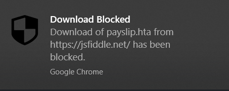

# Download Blocker

## What is it?

Download Blocker is a Google Chrome extension which blocks certain files from being downloaded. It was created as a way to prevent HTML smuggling attacks, but it can also block downloads from webservers too.

HTML smuggling is essentially a technique for bypassing web-proxies / firewalls that detect executable content being downloaded from a server. It does this by using HTML5 APIs to provide a download without making a request to a webserver. For an in-depth description of HTML smuggling, please see the references below.

## Configuration

This extension was created with enterprises in mind, so configuration isn't available to the end user. Instead, settings are read from the following location:

`C:\ProgramData\SecurityJosh\DownloadBlocker\config.json`

The format of the file is as follows:

    {
        "bannedExtensionsJs" : [],
        "bannedExtensionsServer" : [],

        "alertConfig" : {
            "url" : "https://postman-echo.com/post",
            "headers" : {},
            "method" : "GET|POST",
            "postData" : {},
            "sendAsJson" : true|false
        } 
    }

**bannedExtensionsJs** is an array of file extensions which should be blocked when downloaded via the HTML5 APIs.  

**bannedExtensionsServer** is an array of file extensions which should be blocked when downloaded via a normal web server.

(Both of these properties accept a wildcard operator (*), to block all downloads via that medium.)

**alertConfig** is an optional object which contains a number of parameters used to send a HTTP request when a download is blocked. This can be used to ingest block data into a SIEM or other alert system.

Both URL and the values contained in the postData property can contain the following placeholders, which will be replaced with the actual alert data:
{url}
{filename}
{timestamp}

  
## Default Configuration

If no configuration file is present at the location given above, the following configuration will apply:

    {
        "bannedExtensionsJs" : ["*"],
        "bannedExtensionsServer" : []
    }

## Block Notification

Users are notified of their downloads being blocked via a Chrome notification:

## Testing

The file test.html uses HTML smuggling to download a benign .hta file that opens calc.exe.

https://www.outflank.nl/demo/html_smuggling.html downloads a .doc file with a benign macro using a slightly different method of HTML smuggling. (Not hosted by me, contents not guaranteed!)

Both downloads should be blocked by the default configuration of the extension.

## References

* https://www.nccgroup.com/uk/about-us/newsroom-and-events/blogs/2017/august/smuggling-hta-files-in-internet-exploreredge/  
* https://outflank.nl/blog/2018/08/14/html-smuggling-explained/